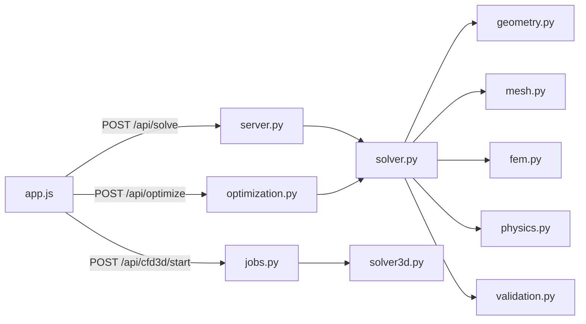

# Aerogen

Интерактивная лаборатория проектирования **ground-effect диффузора** гоночного автомобиля: параметрическая геометрия (Безье), 2D FEM потенциального течения, квази-1D валидация, оптимизация и веб-UI с 2D/3D визуализацией.

| | |
|---|---|
| Запуск | `pip install -r requirements.txt` → `python aerogen.py` |
| UI | http://localhost:8000 |
| Экспорт кода | [PROJECT_EXPORT.md](PROJECT_EXPORT.md) |

## Содержание

- [Физическая постановка](#физическая-постановка)
- [Архитектура](#архитектура)
- [Поток данных](#поток-данных)
- [Ограничения модели](#ограничения-модели)
- [Справочник по файлам](#справочник-по-файлам)
- [HTTP API](#http-api)
- [Запуск](#запуск)

---

## Физическая постановка

### Геометрия

2D сечение ветрового туннеля (вид сбоку):

```text
  y = 2.0 m  ─────────────────────────────  потолок
                ╲                          ╱
  y_floor(x)     ╲___ диффузор (Безье) ___╱
  y = 0  ═════════════════════════════════  пол
  x = 0        1.5            3.5       5.0 m
               └──── зона диффузора ────┘
```

| Параметр | Значение | Роль |
|----------|----------|------|
| `TUNNEL_L` | 5.0 м | Длина туннеля |
| `TUNNEL_H` | 2.0 м | Высота туннеля |
| `CAR_WIDTH` | 1.8 м | Размах → полная downforce |
| `DIFFUSER_X` | 1.5 … 3.5 м | Зона интегрирования силы |

**Режимы параметризации:**

- `simple` — 4 контрольные точки по x, 2 свободных `y` (середина кривой).
- `pro` — 6 точек, 6 свободных `y`; концы закреплены на `y = 0.05 м`.

### 2D FEM: потенциальный поток

Несжимаемое безвихревое течение:

$$\nabla^2 \phi = 0$$

Скорость: $\mathbf{u} = \nabla\phi$. Давление (Бернулли):

$$p = -\tfrac{1}{2}\,\rho\,|\mathbf{u}|^2, \quad \rho = 1.225\ \text{кг/м}^3$$

**Граничные условия**

| Граница | Условие | Смысл |
|---------|---------|-------|
| Inlet (`x=0`) | $\partial\phi/\partial n = -U_\infty$ | Поток 30 м/с |
| Outlet (`x=5`) | $\phi = 0$ (штраф) | Выход |
| Ceiling / Floor | стена | Непроницаемые границы |

**Downforce** (Н/м на единицу размаха):

$$F_y = -\int_{1.5}^{3.5} p_{\text{floor}}(x)\,dx$$

Интеграл — по рёбрам `Floor` в `fem.integrate_downforce`.

### Квази-1D валидация

Канальная модель (непрерывность + Бернулли):

$$u(x)\,h(x) = u_{in}\,h_{ref}, \qquad h(x) = TUNNEL\_H - y_{floor}(x)$$

$$\Delta F_{1D} = \int_{1.5}^{3.5} \tfrac{1}{2}\rho\,(u^2 - u_{in}^2)\,dx$$

Связь с FEM: $\Delta F_{FEM} \approx k_{2D}\,\Delta F_{1D}$, где $k_{2D} \approx 2.05$ калибруется по 4 бенчмаркам (`validation.BENCHMARKS`). **~99% agreement** — совпадение **тренда**, не абсолютной точности CFD.

### Критерий 12°

Потенциальный поток не моделирует отрыв ПС. Инженерный прокси:

$$\max|dy_{floor}/dx| \leq \tan(12°) \approx 0.2125$$

При превышении: `separation_risk_pct`, штраф оптимизатора, предупреждение в UI.

### 3D CFD

`cfd3d` решает 3D Лаплас на сетке 72×36×18. Итоговая downforce:

$$F_{3D} = F_{2D\_FEM} \times CAR\_WIDTH$$

3D поле — визуализация; интеграл силы привязан к 2D FEM.

---

## Архитектура

```text
aerogen.py
aerogen/
  constants.py      физические константы
  geometry.py       Безье, валидация, repair
  mesh.py           Gmsh, 2D сетка
  fem.py            FEM Лапласа, Бернулли, интеграл
  physics.py        Cl, Cp recovery, risk
  solver.py         пайплайн + кэш
  optimization.py   DE + Nelder-Mead
  validation.py     квази-1D, conference metrics
  server.py         HTTP API
  json_util.py      numpy → JSON
  cfd3d/
    solver3d.py     3D Лаплас
    jobs.py         фоновые задачи
web/
  index.html
  static/js/        app, viewer2d, viewer3d, colormap
  static/css/       style.css
```



---

## Поток данных

1. Слайдер `y_params` → `POST /api/solve`
2. `sanitize_y_params` → `generate_mesh` (Gmsh)
3. `solve_potential_flow` → $K\phi = f$
4. `compute_velocities_and_pressures` → $u, v, p$
5. `integrate_downforce` → $F_y$
6. `compute_metrics` + `conference_metrics`
7. JSON → `viewer2d` / панель метрик

---

## Ограничения модели

| Моделируется | Не моделируется |
|--------------|-----------------|
| Потенциальный поток, блокировка канала | Вязкость, турбулентность, отрыв |
| Стационарный 2D сечение | Колёса, нестационарность |
| Тренд формы диффузора | Абсолютные Н как в туннеле |

Абсолютная downforce может отличаться от CFD/туннеля на **50–80%**; относительное сравнение форм — в рамках постановки корректно.

---

## Справочник по файлам

### Корень

| Файл | Назначение |
|------|------------|
| `aerogen.py` | Точка входа → `aerogen.__main__.main()` |
| `run.bat` | Запуск на Windows |
| `requirements.txt` | numpy, scipy, gmsh |
| `export_to_md.py` | Генерация `PROJECT_EXPORT.md` |

### `aerogen/constants.py`

Физические и численные константы: `RHO`, `U_IN`, `TUNNEL_L/H`, `CAR_WIDTH`, `BEZIER_X_*`, `MAX_DIFFUSER_SLOPE`, `PRO_DEFAULTS`.

### `aerogen/geometry.py`

| Функция | Роль |
|---------|------|
| `normalize_y_params` | `[y0,y1]` → полный набор контрольных точек |
| `bernstein_bezier` | Кривая Безье по базису Бернштейна |
| `evaluate_bezier_curve` | Безье для режима simple/pro |
| `max_diffuser_slope` | max \|dy/dx\| на 1.5…3.5 м |
| `sanitize_y_params` | Клиппинг y, ограничение скачков (pro) |
| `repair_y_params` | Сглаживание до уклона ≤ 12° |
| `validate_y_params` | Допустимость для оптимизатора |
| `separation_penalty` | Штраф при уклоне > 12° |
| `param_bounds` | Границы DE: `[0.05, 0.40]` |

### `aerogen/mesh.py`

| Функция | Роль |
|---------|------|
| `init_gmsh` / `shutdown_gmsh` | Жизненный цикл Gmsh |
| `generate_mesh` | Контур туннеля + Безье-пол; треугольники; physical groups Inlet/Outlet/Floor/Ceiling |

### `aerogen/fem.py`

| Функция | Роль |
|---------|------|
| `solve_potential_flow` | Сборка P1-FEM, Neumann inlet, Dirichlet outlet, `spsolve` |
| `compute_velocities_and_pressures` | Градиент φ по элементам → u, v, p |
| `integrate_downforce` | $F_y = -\sum p \cdot \Delta x$ по полу диффузора |
| `get_floor_pressure_profile` | Профиль p(x) для графика |
| `interpolate_to_regular_grid` | Поле на сетке 80×25 для Canvas |

Сборка жёсткости элемента:

$$K_{ij}^{elem} = \frac{b_i b_j + c_i c_j}{2|J|}$$

### `aerogen/physics.py`

| Функция | Роль |
|---------|------|
| `compute_metrics` | `max_slope_deg`, `separation_risk_pct`, `cl_proxy`, `cp_recovery`, `dynamic_pressure` |

### `aerogen/solver.py`

| Функция | Роль |
|---------|------|
| `set_inlet_velocity` | Глобальный $U_{in}$ |
| `make_cache_key` | Ключ кэша FEM |
| `run_fem_pipeline` | mesh → solve → downforce |
| `objective_function` | $-F_y$ для оптимизатора |
| `build_solve_response` | Полный JSON для API |

### `aerogen/optimization.py`

| Функция | Роль |
|---------|------|
| `optimize_diffuser` | Differential Evolution → Nelder-Mead; история `y_params`, downforce |

### `aerogen/validation.py`

| Функция | Роль |
|---------|------|
| `quasi_1d_downforce` | $\Delta F_{1D}$ vs плоский пол |
| `_fem_delta` | $\Delta F_{FEM}$ vs плоский пол |
| `compute_calibration` | 4 бенчмарка → $k_{2D}$, agreement % |
| `conference_metrics` | span DF, vs stock/flat, performance index |
| `run_validation_report` | `GET /api/validate` |

### `aerogen/server.py`

| Маршрут | Метод | Действие |
|---------|-------|----------|
| `/`, `/static/*` | GET | UI и статика |
| `/api/solve` | POST | FEM-расчёт |
| `/api/optimize` | POST | Оптимизация |
| `/api/cfd3d/start` | POST | Старт 3D |
| `/api/cfd3d/status` | GET | Прогресс 3D |
| `/api/validate?mode=` | GET | Калибровка |

### `aerogen/json_util.py`

`json_sanitize` — рекурсивная конвертация numpy → native Python для JSON.

### `aerogen/cfd3d/solver3d.py`

| Класс / функция | Роль |
|-----------------|------|
| `TunnelCFD3D` | 3D маска fluid, Лаплас, φ → u,v,w → Bernoulli p |
| `_viscous_floor_correction` | Лёгкая вязкая поправка у пола |
| `run_cfd3d` | Фабрика 72×36×18 |

### `aerogen/cfd3d/jobs.py`

Фоновый поток: `start_cfd3d_job` → `run_cfd3d` → `cfd_runs/<id>/result.json`; UI поллит status.

### Web

| Файл | Роль |
|------|------|
| `web/index.html` | Разметка панели, слайдеры, canvas |
| `app.js` | API, метрики, debounce 350 ms |
| `viewer2d.js` | Давление, стрелки, частицы, drag точек Безье |
| `viewer3d.js` | Three.js туннель 5×2×1.8 м |
| `colormap.js` | Единая шкала Cp для 2D/3D |
| `style.css` | Стили UI |

---

## HTTP API

### `POST /api/solve`

```json
{
  "mode": "simple",
  "y_params": [0.10, 0.10],
  "u_in": 30.0
}
```

Ответ: `downforce`, `grid`, `span_downforce_N`, `model_agreement_pct`, `vs_baseline_pct`, `floor_pressure_x`, `floor_pressure_p`, …

### `POST /api/optimize`

Тело как у solve. Ответ: `history[]`, `optimal{y_params, downforce, improvement_pct}`.

### `POST /api/cfd3d/start`

Запуск фона. Ответ: `{"status": "success", "message": "..."}`.

### `GET /api/cfd3d/status`

`status`: `idle` | `running` | `done` | `error`; поля `progress`, `message`, `result`.

### `GET /api/validate?mode=simple`

`benchmarks[]`, `calibration_k`, `model_agreement_pct`.

---

## Запуск

```bash
pip install -r requirements.txt
python aerogen.py
```

Gmsh: https://gmsh.info/ (бинарник, если pip-пакет не подтянул).

**Типичный сценарий**

1. Solve — 1–3 с (FEM + mesh)
2. Слайдеры — live-пересчёт
3. Optimize — 1–3 мин
4. Run validation suite — 4 бенчмарка
5. 3D CFD — 30–90 с

### Метрики в UI

| UI | Источник | Ед. |
|----|----------|-----|
| Downforce | `fem.integrate_downforce` | Н/м |
| Validated DF (1.8 m) | `downforce × 1.8` | Н |
| Model match | `case_agreement_pct` | % |
| vs stock | FEM vs baseline | % |
| Cal. factor k | `k2d` | — |
| Angle | `max_slope_deg` | ° |
| Risk | `separation_risk_pct` | % |

---

*Aerogen v2.0 — потенциальный ground-effect diffusor lab. Для сертификации нужен вязкий CFD или туннель; для сравнения форм модель согласована с квази-1D теорией канала.*
